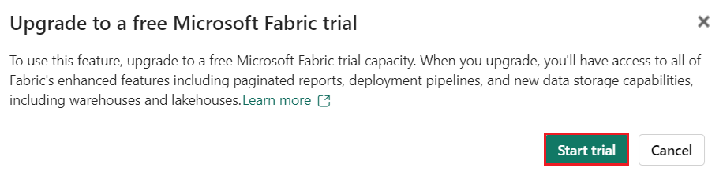
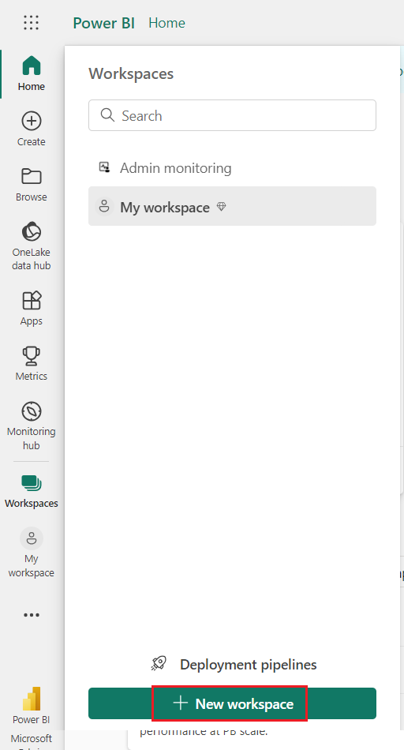

# Lab 01: Train and track machine learning models with MLflow in Microsoft Fabric

**Introduction**

In this Use case, you’ll train a machine learning model to predict a
quantitative measure of diabetes. You’ll train a regression model with
scikit-learn, and track and compare your models with MLflow.By
completing this lab, you’ll gain hands-on experience in machine learning
and model tracking, and learn how to work
with *notebooks*, *experiments*, and *models* in Microsoft Fabric.

**Objectives**

- To create Fabric workspace with trial enabled.

- To set up "TrainModel_Lakehouse" and upload data.

- To create a notebook for interactive coding.

- To load data into Pandas and Spark DataFrames.

- To train Logistic Regression and Decision Tree models, track with
  MLflow.

- To manage experiments using MLflow: list, retrieve, and order runs.

- To explore experiment results in Microsoft Fabric.

- To save best model as "model-churn" in Registered versions.

- To rename and save the notebook, end Spark session.

- To delete the created workspace in Microsoft Fabric.

## Task 0: Sync Host environment time 

1.  In your VM, navigate and click in the **Search bar**, type
    **Settings** and then click on **Settings** under **Best match**.  

 

2.  On Settings window, navigate and click on **Time & language**. 

 

3.  On **Time & language** page, navigate and click on **Date & time**. 

 

4.  Scroll down and navigate to **Additional settings** section, then
    click on **Syn now** button. It will take 3-5 minutes to syn. 

 

5.  Close the **Settings** window.  

## Task 1: Sign in to Power BI account and sign up for the free [Microsoft Fabric trial](https://learn.microsoft.com/en-us/fabric/get-started/fabric-trial)

1.  Open your browser, navigate to the address bar, and type or paste
    the following URL:
    [https://app.fabric.microsoft.com/](https://app.fabric.microsoft.com/,)
    then press the **Enter** button.

>  alt="A search engine window with a red box Description automatically generated with medium confidence" />

2.  In the **Microsoft Fabric** window, enter your given credentials,
    and click on the **Submit** button.

>  alt="A close up of a white and green object Description automatically generated" />

3.  Then, In the **Microsoft** window enter the password and click on
    the **Sign in** button**.**

>  alt="A login screen with a red box and blue text Description automatically generated" />

4.  In **Stay signed in?** window, click on the **Yes** button.

>  alt="A screenshot of a computer error Description automatically generated" />

5.  You’ll be directed to Power BI Home page.

6.  On **Power BI Home** page, click on the **Account manager** on the
    right side. In the Account manager blade, navigate and
    select **Start trial as shown in the below image.**

7.  If prompted, agree to the terms and then select **Start trial**.

>  alt="A screenshot of a computer Description automatically generated" />

8.  Once your trial capacity is ready, you receive a confirmation
    message. Select **Fabric Home Page** to begin working in Fabric.

>  alt="A screenshot of a computer Description automatically generated" />

9.  Open your Account manager again. Notice that you now have a heading
    for **Trial status**. Your Account manager keeps track of the number
    of days remaining in your trial. You will also see the countdown in
    your Fabric menu bar when you work in a product experience.

>  alt="A screenshot of a computer Description automatically generated" />

## Task 2: Create a workspace

Before working with data in Fabric, create a workspace with the Fabric
trial enabled.

1.  In the **Microsoft Fabric** home page, select the **Power BI**
    template.

>  alt="A screenshot of a computer Description automatically generated" />

2.  In the **Power BI Home** page menu bar on the left,
    select **Workspaces** (the icon looks similar to 🗇).

>  alt="A screenshot of a computer Description automatically generated" />

3.  In the Workspaces pane Select **+** **New workspace**.

>  alt="A screenshot of a computer Description automatically generated" />

4.  In the **Create a workspace tab**, enter the following details and
    click on the **Apply** button.

| **Name** | ***TrainModel_FabricXX** (*XX can be a unique number) (here, we entered **TrainModel_Fabric29*)*** |
|----|----|
| **Advanced** | Under **License mode**, select **Trial** |
| **Default storage format** | **Small dataset storage format** |

>  alt="A screenshot of a computer Description automatically generated" />

5.  Wait for the deployment to complete. It takes 2-3 minutes to
    complete. When your new workspace opens, it should be empty.

## Task 3: Create a lakehouse and upload files

Now that you have a workspace, it’s time to switch to the *Data
science* experience in the portal and create a data lakehouse for the
data files you’re going to analyze.

1.  At the bottom left of the Power BI portal, select the **Power
    BI** icon and switch to the **Data Engineering** experience.

>  style="width:4.25833in;height:7.49167in" />

2.  In the **Synapse** **Data engineering** **Home** page, select
    **Lakehouse** under **New** pane.

>  alt="A screenshot of a computer Description automatically generated" />

3.  In the **New lakehouse** dialog box, enter
    +++**TrainModel_Lakehouse+++** in the **Name** field, click on the
    **Create** button.

4.  A new empty lakehouse will be created. You need to ingest some data
    into the **TrainModel_Lakehouse** for analysis.

5.  Wait for few minutes, you’ll will receive a notification stating -
    **Successfully created SQL endpoint**.

>  alt="A screenshot of a computer Description automatically generated" />

## Task 4: Create a notebook

To train a model, you can create a *notebook*. Notebooks provide an
interactive environment in which you can write and run code (in multiple
languages) as *experiments*.

1.  At the bottom left of the TrainModel_Lakehouse page, select
    the **Data engineering** icon and switch to the **Data
    science** experience.

> 

2.  In the **Synapse Data Science** **Home** page, select
    **Notebook**under current workspace of **TrainModel_FabricXX.**

3.  After a few seconds, a new notebook containing a single *cell* will
    open. Notebooks are made up of one or more cells that can
    contain **code** or **markdown** (formatted text).

>  alt="A screenshot of a computer Description automatically generated" />

4.  Select the first cell (which is currently a *code* cell), and then
    in the dynamic tool bar at its top-right, use the **M↓** button to
    convert the cell to a *markdown* cell.

When the cell changes to a markdown cell, the text it contains is
rendered.

5.  Use the **🖉 (Edit**) button to switch the cell to editing mode, then
    delete the content and enter the following text:

> +++# Train a machine learning model and track with MLflow+++

## Task 5: Load data into a dataframe

Now you’re ready to run code to get data and train a model. You’ll work
with the [diabetes
dataset](https://learn.microsoft.com/azure/open-datasets/dataset-diabetes?tabs=azureml-opendatasets?azure-portal=true) from
the Azure Open Datasets. After loading the data, you’ll convert the data
to a Pandas dataframe: a common structure for working with data in rows
and columns.

1.  In the **Lakehouse explorer** section, select Lakehouses and click
    on the **Add** button under the **Add lakehouse** to add a
    lakehouse.

> 
>
>  alt="A screenshot of a computer Description automatically generated" />

2.  In **Add lakehouse** dialog box, select **Existing lakehouse** radio
    button and select **Add**.

>  alt="A screenshot of a computer Description automatically generated" />

3.  In **Choose the data you want to connect** page, select your
    lakehouse i.e., **TrainModel**\_**Lakehouse**, then click on the
    **Add** button.

4.  In your notebook, use the **+ Code** icon below the latest cell
    output to add a new code cell to the notebook.

> **Tip**: To see the **+ Code** icon, move the mouse to just below and
> to the left of the output from the current cell. Alternatively, in the
> menu bar, on the **Edit** tab, select **+ Add code cell**.

5.  Enter the following code in it:

> +++# Azure storage access info for open dataset diabetes
>
> blob_account_name = "azureopendatastorage"
>
> blob_container_name = "mlsamples"
>
> blob_relative_path = "diabetes"
>
> blob_sas_token = r"" \# Blank since container is Anonymous access
>
> \# Set Spark config to access blob storage
>
> wasbs_path = f"wasbs://%s@%s.blob.core.windows.net/%s" %
> (blob_container_name, blob_account_name, blob_relative_path)
>
> spark.conf.set("fs.azure.sas.%s.%s.blob.core.windows.net" %
> (blob_container_name, blob_account_name), blob_sas_token)
>
> print("Remote blob path: " + wasbs_path)
>
> \# Spark read parquet, note that it won't load any data yet by now
>
> df = spark.read.parquet(wasbs_path)+++
>
> 

6.  Use the **▷ Run cell** button on the left of the cell to run it.
    Alternatively, you can press **SHIFT** + **ENTER** on your keyboard
    to run a cell.

> **Note**: Since this is the first time you’ve run any Spark code in
> this session, the Spark pool must be started. This means that the
> first run in the session can take a minute or so to complete.
> Subsequent runs will be quicker.

7.  Use the **+ Code** icon below the cell output to add a new code cell
    to the notebook, and enter the following code in it. Use the **▷ Run
    cell** button on the left of the cell to run it

> codeCopy
>
> +++display(df)+++

8.  When the cell command has completed, review the output below the
    cell, which should look similar to this:

> The output shows the rows and columns of the diabetes dataset

9.  The data is loaded as a Spark dataframe. Scikit-learn will expect
    the input dataset to be a Pandas dataframe. Run the code below to
    convert your dataset to a Pandas dataframe:

> +++import pandas as pd
>
> df = df.toPandas()
>
> df.head()+++
>
>  style="width:6.49167in;height:5.08333in" />

## Task 6: Train a machine learning model

Now that you’ve loaded the data, you can use it to train a machine
learning model and predict customer churn. You’ll train a model using
the Scikit-Learn library and track the model with MLflow.

1.  Hover your mouse below the output cell, you’ll see the **+
    Code** icon. Click on the **+ Code** icon and enter the following
    code in the cell. Use the **▷ Run cell** button on the left of the
    cell to run it

+++from sklearn.model_selection import train_test_split

X, y =
df\[\['AGE','SEX','BMI','BP','S1','S2','S3','S4','S5','S6'\]\].values,
df\['Y'\].values

X_train, X_test, y_train, y_test = train_test_split(X, y,
test_size=0.30, random_state=0)+++

2.  Add another new code cell to the notebook, enter the following code
    in it, and run it:

> import mlflow
>
> experiment_name = "experiment-diabetes"
>
> mlflow.set_experiment(experiment_name)

The code creates an MLflow experiment named **experiment-diabetes**.
Your models will be tracked in this experiment.

3.  Add another new code cell to the notebook, enter the following code
    in it, and run it.

> +++from sklearn.linear_model import LinearRegression
>
> with mlflow.start_run():
>
> mlflow.autolog()
>
> model = LinearRegression()
>
> model.fit(X_train, y_train)
>
> mlflow.log_param("estimator", "LinearRegression")+++

The code trains a regression model using Linear Regression. Parameters,
metrics, and artifacts, are automatically logged with MLflow.
Additionally, you’re logging a parameter called **estimator** with the
value *LinearRegression*.

4.  Add another new code cell to the notebook, enter the following code
    in it, and run it.

> +++from sklearn.tree import DecisionTreeRegressor
>
> with mlflow.start_run():
>
> mlflow.autolog()
>
> model = DecisionTreeRegressor(max_depth=5)
>
> model.fit(X_train, y_train)
>
> mlflow.log_param("estimator", "DecisionTreeRegressor")+++

The code trains a regression model using Decision Tree Regressor.
Parameters, metrics, and artifacts, are automatically logged with
MLflow. Additionally, you’re logging a parameter
called **estimator** with the value *DecisionTreeRegressor*.

## Task 7:Use MLflow to search and view your experiments

When you’ve trained and tracked models with MLflow, you can use the
MLflow library to retrieve your experiments and its details.

1.  To list all experiments, use the following code. Use the **+
    Code** icon below the cell output to add a new code cell to the
    notebook, and enter the following code in it. Use the **▷ Run
    cell** button on the left of the cell to run it

+++import mlflow

experiments = mlflow.search_experiments()

for exp in experiments:

print(exp.name)+++

2.  To retrieve a specific experiment, you can get it by its name. Use
    the **+ Code** icon below the cell output to add a new code cell to
    the notebook, and enter the following code in it. Use the **▷ Run
    cell** button on the left of the cell to run it

+++experiment_name = "experiment-diabetes"

exp = mlflow.get_experiment_by_name(experiment_name)

print(exp)+++

3.  Using an experiment name, you can retrieve all jobs of that
    experiment. Use the **+ Code** icon below the cell output to add a
    new code cell to the notebook, and enter the following code in it.
    Use the **▷ Run cell** button on the left of the cell to run it.

+++ mlflow.search_runs(exp.experiment_id)+++

4.  To more easily compare job runs and outputs, you can configure the
    search to order the results. For example, the following cell orders
    the results by *start_time*, and only shows a maximum of 2 results.

5.  Use the **+ Code** icon below the cell output to add a new code cell
    to the notebook, and enter the following code in it. Use the **▷ Run
    cell** button on the left of the cell to run it.

+++ mlflow.search_runs(exp.experiment_id, order_by=\["start_time
DESC"\], max_results=2)+++

6.  Finally, you can plot the evaluation metrics of multiple models next
    to each other to easily compare models:

7.  Use the **+ Code** icon below the cell output to add a new code cell
    to the notebook, and enter the following code in it. Use the **▷ Run
    cell** button on the left of the cell to run it.

> +++import matplotlib.pyplot as plt
>
> df_results = mlflow.search_runs(exp.experiment_id,
> order_by=\["start_time DESC"\],
> max_results=2)\[\["metrics.training_r2_score", "params.estimator"\]\]
>
> fig, ax = plt.subplots()
>
> ax.bar(df_results\["params.estimator"\],
> df_results\["metrics.training_r2_score"\])
>
> ax.set_xlabel("Estimator")
>
> ax.set_ylabel("R2 score")
>
> ax.set_title("R2 score by Estimator")
>
> for i, v in enumerate(df_results\["metrics.training_r2_score"\]):
>
> ax.text(i, v, str(round(v, 2)), ha='center', va='bottom',
> fontweight='bold')
>
> plt.show()+++
>
>  style="width:6.8546in;height:4.17083in" />

## Task 8: Explore your experiments

Microsoft Fabric will keep track of all your experiments and allows you
to visually explore them.

1.  Select **TrainModel_FabricXX** in the left navigation pane.

2.  In the **TrainModel_FabricXX** pane ,Select
    the **experiment-diabetes** experiment to open it.

3.  In the **experiment-diabetes** pane, Select the **View** tab and
    select **Run list**.

4.  Select the two latest runs by checking each box.

5.  As a result, your two last runs will be compared to each other in
    the **Metric comparison** pane. By default, the metrics are plotted
    by run name.

6.  Select the **🖉** (Edit) button of the graph visualizing the mean
    absolute error for each run.and enter the below details

- Change the **visualization type** to **bar**.

- Change the **X-axis** to **estimator**.

- Select **Replace** and explore the new graph.

By plotting the performance metrics per logged estimator, you can review
which algorithm resulted in a better model.

## Task 9: Save the model

After comparing machine learning models that you’ve trained across
experiment runs, you can choose the best performing model. To use the
best performing model, save the model and use it to generate
predictions.

1.  In the experiment overview, ensure the **View** tab is selected and
    select **Run details**

7.  Select the run with the highest Training R2 score and click on
    the** Save **in the Save run as model box (you may need to scroll to
    the right to see this).

8.  Select **Save as ML model** in the newly opened pop-up window,
    select the **model** folder and name the model **model-diabetes**.
    Now click on the **Save**.

9.  Select **View ML model** in the notification that appears at the top
    right of your screen when the model is created. You can also refresh
    the window. The saved model is linked under **Model versions**.

Note that the model, the experiment, and the experiment run are linked,
allowing you to review how the model is trained.

## Task 10: Save the notebook and end the Spark session

Now that you’ve finished training and evaluating the models, you can
save the notebook with a meaningful name and end the Spark session.

1.  Select **Notebook 1** in the left navigation pane.

2.  In the notebook menu bar, use the ⚙️ **Settings** icon to view the
    notebook settings

3.  Set the **Name** of the notebook to **Train and compare models**,
    and then close the settings pane.

4.  On the notebook menu, select **Stop session** to end the Spark
    session.

## Task 11: Clean up resources

In this exercise, you have created a notebook and trained a machine
learning model. You used Scikit-Learn to train the model and MLflow to
track it´s performance.

If you’ve finished exploring your model and experiments, you can delete
the workspace you created for this exercise.

1.  In the bar on the left, select the icon for your workspace i.e
    **TrainModel_FabricXX** to view all of the items it contains.

>  alt="A screenshot of a computer Description automatically generated" />

2.  In the menu on the toolbar, select **Workspace settings**.

>  alt="A screenshot of a search Description automatically generated" />

5.  Select **General** and click on **Remove this workspace.**

> 

6.  In the **Delete workspace?** dialog box, click on the **Delete**
    button.

>  alt="A screenshot of a computer Description automatically generated" />

**Summary**

You’ve created a workspace in Microsoft Fabric with a trial enabled.
Then, you’ve proceeded to set up a data lakehouse, ingested data for
analysis, and created a notebook for interactive coding. You’ve loaded
data into both Pandas and Spark DataFrames, and subsequently trained
machine learning models using Scikit-Learn while tracking their
performance with MLflow. You’ve effectively managed experiments using
MLflow, listing, retrieving, and ordering runs. Additionally, you’ve
explored experiment results in Microsoft Fabric, visualizing and
comparing model accuracy. The best performing model was saved for future
use, and the notebook was appropriately named and saved. Finally, you’ve
completed the lab by cleaning up resources and deleting the workspace
created for the exercise.
