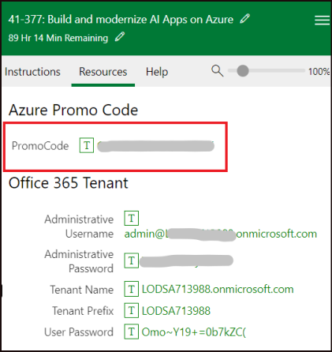
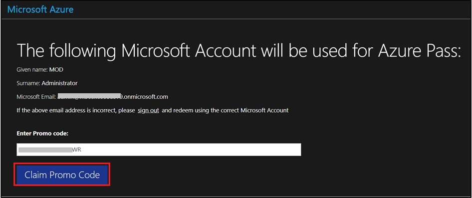
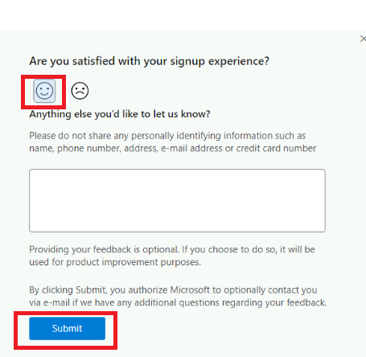

# Lab 04- Chatting with your data using AI Skills in Microsoft Fabric

With the Microsoft Fabric AI skill, you can make data more accessible to
your colleagues. You can configure a generative AI system to generate
queries that answer questions about your data. After you configure the
AI skill, you can share it with your colleagues, who can then ask their
questions in plain English. Based on their questions, the AI generates
queries over your data that answer those questions.

The AI skill relies on generative AI, specifically, large language
models (LLMs). These LLMs can generate queries, for example, T-SQL
queries, based on a specific schema and a question. The system sends a
question in the AI skill, information about the selected data (including
the table and column names, and the data types found in the tables) to
the LLM. Next, it requests generation of a T-SQL query that answers the
question. Parse the generated query to first ensure that it doesn't
change the data in any way. Then execute that query. Finally, show the
query execution results. An AI skill is intended to access specific
database resources, and then generate and execute relevant T-SQL
queries.

**Important Note**: When you take a break, please pause the Fabric
capacity in the Azure portal.

## **Task 0: Sync Host environment time**

1.  In your VM, navigate and click in the **Search bar**, type
    **Settings** and then click on **Settings** under **Best match**.

>  alt="A screenshot of a computer Description automatically generated" />

2.  On Settings window, navigate and click on **Time & language**.

3.  On **Time & language** page, navigate and click on **Date & time**.

4.  Scroll down and navigate to **Additional settings** section, then
    click on **Syn now** button. It will take 3-5 minutes to syn.

5.  Close the **Settings** window.

## Task 0: Redeem Azure Pass

1.  Open a new tab on your browser and enter the following link in the
    address bar: <https://www.microsoftazurepass.com/>

2.  Then, click on the **Start button.**

**Note**: Do not use your Company/Work Account to login to redeem the
Azure Pass, another Azure Pass will not be issued.

3.  Click on the **Resources** tab of the Lab VM and enter the **Office
    365 tenant credentials** to **Sign In**.

>  alt="A screenshot of a computer Description automatically generated" />

4.  Crosscheck the Email ID and then click on the **Confirm Microsoft
    Account**.

5.  Click on the **Resources** tab and copy the **Promo Code**. Navigate
    to **Enter Promo code** box and paste the Promo Code that have you
    copied, then click on the **Claim Promo Code button.**

>  alt="A screenshot of a computer Description automatically generated" />

6.  Enter correct details in **Your Profile** page, tick all the check
    boxes, and then click on **Sign up** button.

7.  On **Are you satisfied with your signup experience** window, enter
    your feedback and click on the **Submit** button.

8.  It would automatically redirect you to the Azure Portal and now you
    are ready to use Azure services. On **Welcome to Microsoft Azure**
    dialog box, click on the **Maybe later** button.

## Task 1: Sign in to Power BI account and sign up for the free [Microsoft Fabric trial](https://learn.microsoft.com/en-us/fabric/get-started/fabric-trial)

1.  Open your browser, navigate to the address bar, and type or paste
    the following URL: !!https://app.fabric.microsoft.com/!! then press
    the **Enter** button.

>  alt="A search engine window with a red box Description automatically generated with medium confidence" />

2.  In the **Microsoft Fabric** window, enter your given credentials,
    and click on the **Submit** button.

>  alt="A close up of a white and green object Description automatically generated" />

3.  Then, In the **Microsoft** window enter the password and click on
    the **Sign in** button**.**

>  alt="A login screen with a red box and blue text Description automatically generated" />

4.  In **Stay signed in?** window, click on the **Yes** button.

>  alt="A screenshot of a computer error Description automatically generated" />

5.  You’ll be directed to Power BI Home page.

6.  On **Power BI Home** page, click on the **Account manager** on the
    right side. In the Account manager blade, navigate and
    select **Start trial as shown in the below image.**

7.  If prompted, agree to the terms and then select **Start trial**.

>  alt="A screenshot of a computer Description automatically generated" />

8.  Once your trial capacity is ready, you receive a confirmation
    message. Select **Fabric Home Page** to begin working in Fabric.

>  alt="A screenshot of a computer Description automatically generated" />

9.  Open your Account manager again. Notice that you now have a heading
    for **Trial status**. Your Account manager keeps track of the number
    of days remaining in your trial. You will also see the countdown in
    your Fabric menu bar when you work in a product experience.

>  alt="A screenshot of a computer Description automatically generated" />

## Task 2: Create Fabric Capacity using Azure portal 

Microsoft Fabric is deployed to an Azure Active Directory tenant. Within
each Fabric tenant, Fabric capacities can be created to group resources
for various purposes -- this might be done organizationally (sales,
marketing, development), geographically, or other logical grouping.

If a Fabric Trial is available, we recommend taking advantage of that
opportunity to try Microsoft Fabric for a period of time (currently 60
days) with no commitment. To see if you are in a trial or eligible for a
trial, visit the [Fabric portal](https://app.fabric.microsoft.com/). If
you are able to log in or presented the option to start a trial, you
should be all set!

To create a Fabric capacity outside of a trial environment, create a new
resource from the Azure portal, and search for Fabric.

1.  Open your browser, navigate to the address bar, type or paste the
    following URL: !!https://portal.azure.com/!!, then press the
    **Enter** button.

2.  From the Azure portal home page, click on **Azure portal menu**
    represented by three horizontal bars on the left side of the
    Microsoft Azure command bar as shown in the below image.

>  alt="A screenshot of a computer Description automatically generated" />

3.  Navigate and click on **+ Create a resource**.

>  alt="A screenshot of a computer Description automatically generated" />

4.  On **Create a resource** page, in the **Search services and
    marketplace** search bar, type!!**Fabric!!**, then select
    **Microsoft fabric**.

>  alt="A screenshot of a computer Description automatically generated" />

5.  In the **Marketplace** page, navigate to the **Microsoft Fabric**
    section, click on the **Create** button dropdown, then select
    **Microsoft Fabric** as shown in the image.

>  alt="A screenshot of a computer Description automatically generated" />

6.  In the **Create Fabric capacity** window, under the **Basics** tab,
    enter the following details and click on the **Review+create**
    button.

<table>
<colgroup>
<col style="width: 25%" />
<col style="width: 74%" />
</colgroup>
<thead>
<tr class="header">
<th><strong>Subscription</strong></th>
<th><blockquote>

Select the assigned subscription

</blockquote></th>
</tr>
</thead>
<tbody>
<tr class="odd">
<td><strong>Resource group</strong></td>
<td>Click on <strong>Create new</strong>&gt; enter
!!<strong>AI-Skill-FabricXXX!!</strong>(XXX can be a unique number, you
can add more digits after XXX to make the name unique)</td>
</tr>
<tr class="even">
<td><strong>Capacity name</strong></td>
<td><strong>!!aiskillfabric789!!</strong>( XXX can be a unique number,
you can add more digits after XXX to make the name unique)</td>
</tr>
<tr class="odd">
<td><strong>Region</strong></td>
<td>Select near by available region, in this lab <strong>West US
3</strong> is using for this resource</td>
</tr>
<tr class="even">
<td><strong>Size</strong></td>
<td>select <strong>F64</strong> SKU</td>
</tr>
</tbody>
</table>

> 
>
> 

7.  Once the Validation is succeeded, click on the **Create** button.

>  alt="A screenshot of a computer Description automatically generated" />
>
>  alt="A screenshot of a computer Description automatically generated" />

8.  After the deployment is completed, click on the **Go to resource**
    button.

>  alt="A screenshot of a computer Description automatically generated" />

## **Task 3: Create a Fabric workspace**

In this task, you create a Fabric workspace. The workspace contains all
the items needed for this lakehouse tutorial, which includes lakehouse,
dataflows, Data Factory pipelines, the notebooks, Power BI datasets, and
reports.

1.  Open your browser, navigate to the address bar, and type or paste
    the following URL: !!https://app.fabric.microsoft.com/!! then press
    the **Enter** button.

>  alt="A search engine window with a red box Description automatically generated with medium confidence" />

2.  In the **Microsoft Fabric** window, enter your credentials, and
    click on the **Submit** button.

>  alt="A close up of a white and green object Description automatically generated" />

3.  Then, In the **Microsoft** window enter the password and click on
    the **Sign in** button**.**

>  alt="A login screen with a red box and blue text Description automatically generated" />

4.  In **Stay signed in?** window, click on the **Yes** button.

>  alt="A screenshot of a computer error Description automatically generated" />

5.  You’ll be directed to Power BI Home page.

6.  Go back to **Power BI** window. On the left side navigation menu of
    Power BI Home page, navigate and click on **Workspaces**.

7.  In the Workspaces pane, click on **+** **New workspace button.**

>  alt="A screenshot of a computer Description automatically generated" />

8.  In the **Create a workspace** pane that appears on the right side,
    enter the following details, and click on the **Apply** button.

| **Name** | ***!!A**I**-Fabric-XXX!!** (*XXX can be a unique number) (here, we entered ***A**I**-Fabric-XX -789***) |
|----|----|
| **Advanced** | Under **License mode**, select **Fabric** |
| **Default storage format** | **Small dataset storage format** |
| **C**apacity | **aiskillfabricXXX-** |
| **Template apps** | **Check the Develop template apps** |

>  alt="A screenshot of a computer Description automatically generated" />
>
>  style="width:5.45833in;height:6.95833in" />

9.  Wait for the deployment to complete. It takes 2-3 minutes to
    complete.

## Task 4: Copilot tenant settings

1.  On right side of Power BI home page, click on the **Settings** icon.

2.  In **Settings** pane, scroll down to **Governance and insights**,
    then click on **Admin portal** .

3.  In **Admin portal** pane, select **Tenant settings**, scroll down to
    **Copilot and Azure OpenAI Service** section, click on **Users can
    use Copilot and other features powered by Azure OpenAI**, then
    enable it using the **toggle** button. After **Users can use Copilot
    and other features powered by Azure OpenAI** were Enabled, click on
    the **Apply** button.

4.  In **Admin portal** pane, select **Tenant settings**, scroll down to
    **Copilot and Azure OpenAI Service** section, click on **Data sent
    to Azure OpenAI can be processed outside your capacity's geographic
    region, compliance boundary, or national cloud instance**, then
    enable it using the **toggle** button. After **Data sent to Azure
    OpenAI can be processed outside your capacity's geographic region,
    compliance boundary, or national cloud instance** were Enabled,
    click on the **Apply** button.

## **Task 5: Create a lakehouse**

1.  In the **AI-Fabric-XXX** page, click on the **Power BI** icon
    located at the bottom left and select **Data Engineering** under
    Synapse.

> 

2.  In the **Synapse** **Data Engineering** **Home** page,
    select **Lakehouse** to create a lakehouse.

3.  In the **New lakehouse** dialog box, enter
    !!**AI_Fabric_lakehouseXX**!! in the **Name** field, click on the
    **Create** button and open the new lakehouse.

> **Note**: Ensure to remove space before **AI_Fabric_lakehouseXX**.
>
> 

4.  You will see a notification stating **Successfully created SQL
    endpoint**.

>  alt="A screenshot of a computer Description automatically generated" />

5.  Next, create a new notebook to query the table. In
    the **Home** ribbon, select the drop down for **Open notebook** and
    choose **New notebook**.

## Task 6: Upload AdventureWorksDW data into lakehouse

First, create a lakehouse and populate it with the necessary data.

If you already have an instance of AdventureWorksDW in a warehouse or
lakehouse, you can skip this step. If not, create a lakehouse from a
notebook. Use the notebook to populate the lakehouse with the data.

1.  In the query editor, copy and paste the following code. Select
    the **Run all** button to execute the query. After the query is
    completed, you will see the results.

!!import pandas as pd

from tqdm.auto import tqdm

base =
"https://synapseaisolutionsa.blob.core.windows.net/public/AdventureWorks"

\# load list of tables

df_tables = pd.read_csv(f"{base}/adventureworks.csv",
names=\["table"\])

for table in (pbar :=
tqdm(df_tables\['table'\].values)):

pbar.set_description(f"Uploading {table} to
lakehouse")

\# download

df =
pd.read_parquet(f"{base}/{table}.parquet")

\# save as lakehouse table

spark.createDataFrame(df).write.mode('overwrite').saveAsTable(table)!!

After a few minutes, the lakehouse is populated with the necessary data.

## Task 7: Create an AI skill

1.  To create a new AI skill, go to the **Data Science** experience and
    select **AI Skill**.

1.  In the Data Science home page, select **AI Skill(Preview).**

2.  In the **Create AI skill** dialog box, enter !!**AISkillsFabric**!!
    in the **Name** field, click on the **Create** button.

3.  In **Select a lakehouse SQL endpoint for the model to reference.
    You’ll select specific tables in the next step** page, select your
    lakehouse i.e., **AI_Fbric_lakehouseXX**, then click on the
    **Confirm** button.

4.  You must then select the tables for which you want the AI skill to
    have available access.

This lab uses these tables:

- DimCustomer

- DimDate

- DimGeography

- DimProduct

- DimProductCategory

- DimPromotion

- DimReseller

- DimSalesTerritory

- FactInternetSales

- FactResellerSales

**Important Note:** If you face any SKU issues,
please check the workspace License
info.

## Task 8: Provide instructions

1.  When you first ask the AI skill questions with the listed tables
    select **factinternetsales**, the AI skill answers them fairly well.

2.  For instance, for the question !!**What is the most sold
    product?!!**, the AI skill returns:

3.  Copy the all question and SQL queries and paste them in a notepad
    and then Save the notepad to use the information in the upcoming
    tasks

4.  Select FactResellerSales and enter the following text and click on
    the **Submit icon** as shown in the below image.

!!**What is our most sold product?**!!

As you continue to experiment with queries, you should add more
instructions.

5.  Select the **dimcustomer** , enter the following text and click on
    the **Submit icon**

!!**how many active customers did we have June 1st, 2013?**!!

6.  Select the **dimdate,** **FactInternetSales** , enter the following
    text and click on the **Submit icon**

!!**what are the monthly sales trends for the last year?**!!

7.  Select the **dimproduct,** **FactInternetSales** , enter the
    following text and click on the **Submit icon**

!!**which product category had the highest average sales price?**!!

Part of the problem is that "active customer" doesn't have a formal
definition. More instructions in the notes to the model text box might
help, but users might frequently ask this question. You need to make
sure that the AI handles the question correctly

8.  The relevant query is moderately complex, so provide an example by
    selecting the edit button.

9.  In the Example SQL queries tab, select the **+Add example.**

10. You can manually add examples, but you can also upload them from a
    JSON file. Providing examples from a file is helpful when you have
    many SQL queries that you want to upload all at once, instead of
    manually uploading the queries one by one.

11.  Add all the queries and SQL queries that you have saved in Notepad,
    and then click on ‘Download all as .json’.

## Task 9: Use the AI skill programmatically

Both instructions and examples were added to the AI skill. As testing
proceeds, more examples and instructions can improve the AI skill even
further. Work with your colleagues to see if you provided examples and
instructions that cover the kinds of questions they want to ask.

You can use the AI skill programmatically within a Fabric notebook. To
determine whether or not the AI skill has a published URL value.

1.  In the AISkillFabric page, in the **Home** ribbon select the
    **Settings**.

2.  Before you publish the AI skill, it doesn't have a published URL
    value, as shown in this screenshot.

3.  Close the AI Skill setting.

4.  In the **Home** ribbon, select the **Publish**.

5.  After publishing, select ‘Settings’ from the Home ribbon

6.  The published URL for the AI skill appears, as shown in this
    screenshot.

7.  Copy the URL and paste that in a notepad and then Save the notepad
    to use the information in the upcoming

8.  Select **Notebook1** in the left navigation pane.

9.  Use the **+ Code** icon below the cell output to add a new code cell
    to the notebook, enter the following code in it and replace the
    **URL**. Click on **▷ Run** button and review the output

!!import requests

import json

import pprint

from synapse.ml.mlflow import
get_mlflow_env_config

\# the URL could change if the workspace is assigned
to a different capacity

url = "https://\<generic published URL
value\>"

configs = get_mlflow_env_config()

headers = {

"Authorization": f"Bearer
{configs.driver_aad_token}",

"Content-Type": "application/json;
charset=utf-8"

}

question = "{userQuestion: \\what is an example
product?\\}"

response = requests.post(url, headers=headers, data =
question)

print("RESPONSE: ", response)

print("")

response = json.loads(response.content)

print(response\["result"\])!!

## Task 10: Delete the resources

To avoid incurring unnecessary Azure costs, you should delete the
resources you created in this quickstart if they're no longer needed. To
manage resources, you can use the [Azure
portal](https://portal.azure.com/?azure-portal=true).

1.  To delete the storage account, navigate to **Azure portal Home**
    page, click on **Resource groups**.

>  alt="A screenshot of a computer Description automatically generated" />

2.  Click on the assigned resource group.

3.  In the **Resource group** home page, select the **delete resource
    group**

> 

4.  In the **Delete Resources** pane that appears on the right side,
    navigate to **Enter “resource group name” to confirm deletion**
    field, then click on the **Delete** button.

5.  On **Delete confirmation** dialog box, click on **Delete** button.

>  alt="A screenshot of a computer error Description automatically generated" />

6.  Click on the bell icon, you’ll see the notification –**Deleted
    resource group AI-Skill-Fabric890**

7.  Open your browser, navigate to the address bar, and type or paste
    the following URL: !!https://app.fabric.microsoft.com/!! then press
    the **Enter** button.

> 

8.  Select the ***...*** option under the workspace name and
    select **Workspace settings**.

9.  Select **General** and click on **Remove this workspace.**

10. Click on **Delete** in the warning that pops up.

11. Wait for a notification that the Workspace has been deleted, before
    proceeding to the next lab.

