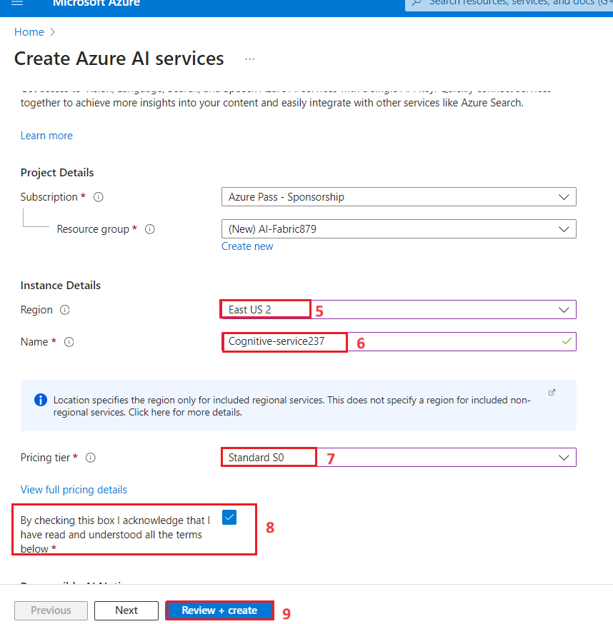
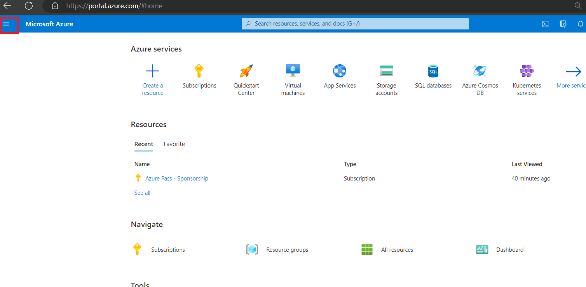
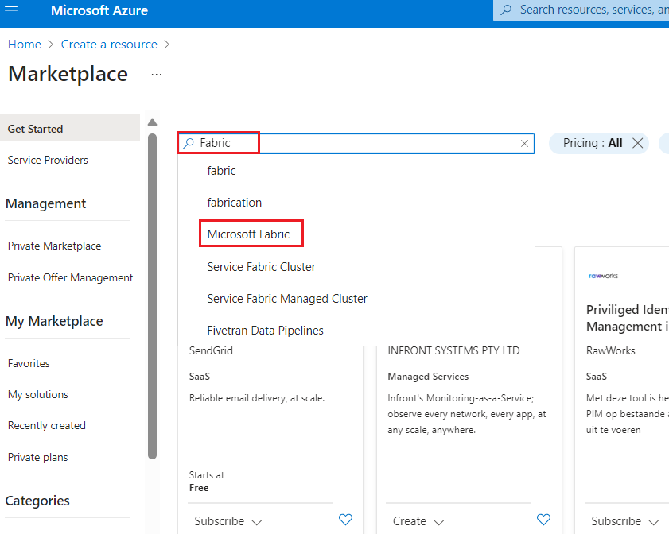
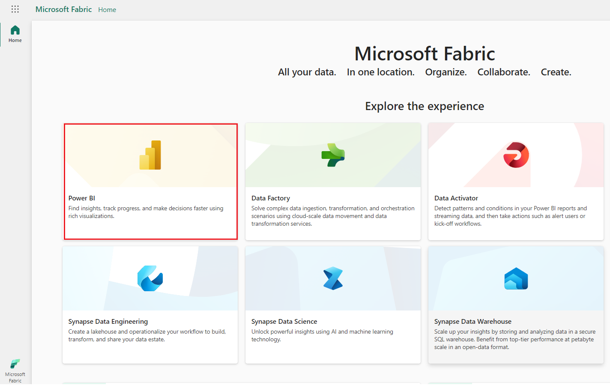
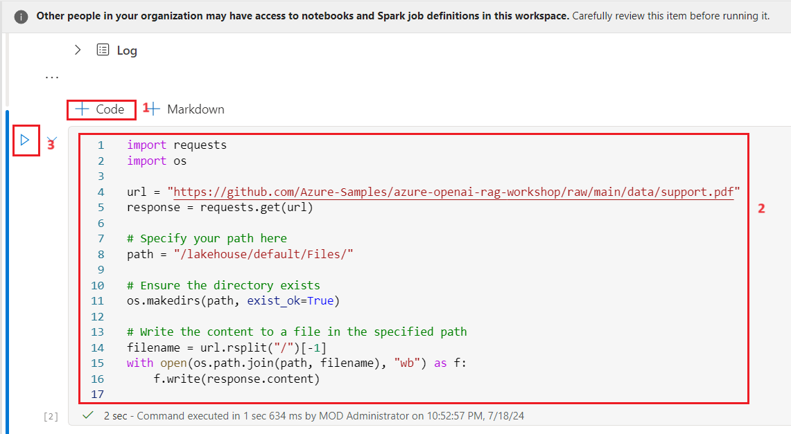

**Introduction **

Analyzing structured data has been an easy process for some time but the
same cannot be said for unstructured data. Unstructured data, such as
text, images, and videos, is more difficult to analyze and interpret.
However, with the advent of advanced AI models, such as OpenAI's GPT-3
and GPT-4, it is now becoming easier to analyze and gain insights from
unstructured data.

An example of such analysis is the ability to query a document for
specific information using natural language which is achievable though a
combination of information retrieval and language generation.

By leveraging the RAG (Retrieval-Augmented Generation) framework, you
can create a powerful question-and-answering pipeline that uses a large
language model (LLM) and you own data to generate responses.

The architecture of such an application is as shown below:

**Objective**

- Create a multi-service resource for Azure AI services using Azure
  portal

- To create fabric capacity and workspace, Key vault, and fabric
  workspace

- Pre-process PDF Documents using Azure AI Document Intelligence in
  Azure AI Services.

- Perform text chunking using SynapseML.

- Generate embeddings for the chunks using SynapseML and Azure OpenAI
  Services.

- Store the embeddings in Azure AI Search.

- Build a question answering pipeline.

# **Exercise 1: Environment Setup**

## Task 1: Create a multi-service resource for Azure AI services

he multi-service resource is listed under **Azure AI
services** \> **Azure AI services multi-service account** in the portal.
To create a multi-service resource follow these instructions:

1.  Select this link to create a multi-service
    resource: https://portal.azure.com/#create/Microsoft.CognitiveServicesAllInOne

2.  On the **Create** page, provide the following information:

| **Project details** | **Description** |
|----|----|
| **Subscription** | Select one of your available Azure subscriptions. |
| **Resource group** | Click on **Create new**\> enter **AI-FabricXX**(XX can be a unique number, you can add more digits after XX to make the name unique) |
| **Region** | Select the appropriate region for your CognitiveServices**.** In this lab, we have chosen the **East US 2** region**.** |
| **Name** | **Cognitive-serviceXXX**( XXX can be a unique number, you can add more digits after XXX to make the name unique) |
| **Pricing tier** | Standard S0 |

3.  Configure other settings for your resource as needed, read and
    accept the conditions (as applicable), and then select **Review +
    create**.

4.  In the **Review+submit** tab, once the Validation is Passed, click
    on the **Create** button.

5.  After the deployment is completed, click on the **Go to resource**
    button.

6.  In your **Azure** **AI service** window, navigate to the **Resource
    Management** section, and click on **Keys and Endpoints**.

7.  In **Keys and Endpoints** page, copy **KEY1, KEY 2,** and
    **Endpoint** values and paste them in a notepad as shown in the
    below image, then **Save** the notepad to use the information in the
    upcoming tasks.

## **Task 2: Create a key vault using the Azure portal**

1.  In Azure portal home page, click on **+ Create Resource**.

>  alt="A screenshot of a computer Description automatically generated" />

2.  In the **Create a resource** page search bar, type **Key vault** and
    click on the appeared **Key vault** .

3.  Click on **Key Vault** section.

>  style="width:5.5229in;height:5.42614in" />

4.  On the **Create a key Vault** page, provide the following
    information and click on **Review+create** button.

| **Field** | **Description** |
|----|----|
| **Subscription** | Select your Azure OpenAI subscription |
| **Resource group** | Select your Resource group(that you have created in **Task 1**) |
| **Region** | EastUS 2 |
| **Name** | fabrickeyvaultXX (XXcan be unique number) |
| **Pricing Tier** | Click on change Price Tire\>select **Standard** |

5.  Once the Validation is passed, click on the **Create**
    button.

>  alt="A screenshot of a computer Description automatically generated" />

5.  After the deployment is completed, click on the **Go to resource**
    button.

>  style="width:5.85795in;height:3.13732in" />

6.  In your **fabrickeyvaultXX** window, from the left menu, click on
    the **Access control(IAM).**

7.  On the Access control(IAM) page, Click +**Add** and select **Add
    role assignments.**

>  style="width:5.43371in;height:4.56721in" />

5.  In **Job function roles,** type the !!**Key vault administrator!!**
    in the search box and select it. Click **Next**

>  style="width:6.49236in;height:5.67431in" />

6.  In the **Add role assignment** tab, select Assign access to User
    group or service principal. Under Members, click **+Select members**

>  style="width:5.32008in;height:5.32008in" />

7.  On the Select members tab, search your Azure OpenAI subscription and
    click **Select.**

>  style="width:3.36623in;height:5.98674in" />

8.  In the **Add role assignment** page, Click **Review + Assign**, you
    will get a notification once the role assignment is complete.

>  style="width:6.00189in;height:5.89661in" />
>
> 

9.  You will see a notification – added as Azure AI Developer for
    Azure-openai-testXX

>  alt="A screenshot of a computer Description automatically generated" />

## Task 3: Create a secret using Azure Key vault

1.  On the Key Vault left-hand sidebar, select **Objects** then
    select **Secrets**.

>  style="width:6.49236in;height:4.06806in" />

2.  Select **+ Generate/Import**.

>  style="width:6.49236in;height:3.62847in" />

3.  On the **Create a secret** page, provide the following information
    and click on **Create** button .

| **Upload options** | Manual                          |
|--------------------|---------------------------------|
| **Name**           | Enter the name !! aisearchkey!! |
| **Secret Value**   | password321                     |

4.  Select **+ Generate/Import**.

5.  On the **Create a secret** page, provide the following information
    and click on **Create** button .

| **Upload options** | Manual                               |
|--------------------|--------------------------------------|
| **Name**           | Enter the name !! **aiservicekey**!! |
| **Secret Value**   | password321                          |

6.  In **Key vault** page, copy **Key vault** name, and **Secrets**
    values and paste them in a notepad as shown in the below image, then
    **Save** the notepad to use the information in the upcoming tasks.

## **Task 4: Create an Azure AI Search service in the portal**

1.  In Azure portal home page, click on **+ Create Resource**.

>  alt="A screenshot of a computer Description automatically generated" />

2.  In the **Create a resource** page search bar, type **Azure AI
    Search** and click on the appeared **azure ai search**.

3.  Click on **azure ai search** section.

4.  In the **Azure AI Search** page, click on the **Create** button.

>  alt="A screenshot of a computer Description automatically generated" />

5.  On the **Create a search service** page, provide the following
    information and click on **Review+create** button.

| **Field** | **Description** |
|----|----|
| **Subscription** | Select your Azure OpenAI subscription |
| **Resource group** | Select your Resource group(that you have created in **Lab 1**) |
| **Region** | EastUS 2 |
| **Name** | mysearchserviceXX (XXcan be unique number) |
| **Pricing Tier** | Click on change Price Tire\>select **Basic** |

6.  Once the Validation is passed, click on the **Create** button.

8.  After the deployment is completed, click on the **Go to resource**
    button.

9.  copy **AI search name** and paste them in a notepad as shown in the
    below image, then **Save** the notepad to use the information in the
    upcoming lab.

## Task 5: Create Fabric Capacity and Workspace

Microsoft Fabric is deployed to an Azure Active Directory tenant. Within
each Fabric tenant, Fabric capacities can be created to group resources
for various purposes -- this might be done organizationally (sales,
marketing, development), geographically, or other logical grouping.

If a Fabric Trial is available, we recommend taking advantage of that
opportunity to try Microsoft Fabric for a period of time (currently 60
days) with no commitment. To see if you are in a trial or eligible for a
trial, visit the [Fabric portal](https://app.fabric.microsoft.com/). If
you are able to log in or presented the option to start a trial, you
should be all set!

To create a Fabric capacity outside of a trial environment, create a new
resource from the Azure portal, and search for Fabric.

1.  From the Azure portal home page, click on **Azure portal menu**
    represented by three horizontal bars on the left side of the
    Microsoft Azure command bar as shown in the below image.

>  alt="A screenshot of a computer Description automatically generated" />

2.  Navigate and click on **+ Create a resource**.

>  alt="A screenshot of a computer Description automatically generated" />

3.  On **Create a resource** page, in the **Search services and
    marketplace** search bar, type+++ **Fabric+++**, then select
    **Microsoft fabric**.

>  alt="A screenshot of a computer Description automatically generated" />

4.  In the **Marketplace** page, navigate to the **Microsoft Fabric**
    section, click on the Create button dropdown, then select
    **Microsoft Fabric** as shown in the image.

>  alt="A screenshot of a computer Description automatically generated" />

5.  In the **Create Fabric capacity** window, under the **Basics** tab,
    enter the following details and click on the **Review+create**
    button.

<table>
<colgroup>
<col style="width: 25%" />
<col style="width: 74%" />
</colgroup>
<thead>
<tr class="header">
<th><strong>Subscription</strong></th>
<th><blockquote>

Select the assigned subscription

</blockquote></th>
</tr>
</thead>
<tbody>
<tr class="odd">
<td><strong>Resource group</strong></td>
<td>Select your Resource group(that you have created in <strong>Task
1</strong>)</td>
</tr>
<tr class="even">
<td><strong>Capacity name</strong></td>
<td><strong>!!fabriccapacity45!!</strong>( XXX can be a unique number,
you can add more digits after XXX to make the name unique)</td>
</tr>
<tr class="odd">
<td><strong>Region</strong></td>
<td>Select <strong>West US 3</strong></td>
</tr>
<tr class="even">
<td><strong>Size</strong></td>
<td>Click on <strong>Change size</strong>&gt; select <strong>F4</strong>
SKU and click on <strong>Select</strong> button</td>
</tr>
</tbody>
</table>

>  style="width:5.2042in;height:4.85795in" />
>
>  alt="A screenshot of a computer screen Description automatically generated" />
>
>  style="width:4.6417in;height:4.13826in" />

6.  In the **Review+submit** tab, once the Validation is Passed, click
    on the **Create** button.

>  style="width:4.88521in;height:4.46401in" />
>
>  alt="A screenshot of a computer Description automatically generated" />

7.  After the deployment is completed, click on the **Go to resource**
    button.

>  style="width:6.49236in;height:3.23472in" />
>
>  alt="A screenshot of a computer Description automatically generated" />

## **Task 6: Create a Fabric workspace**

In this task, you create a Fabric workspace. The workspace contains all
the items needed for this lakehouse tutorial, which includes lakehouse,
dataflows, Data Factory pipelines, the notebooks, Power BI datasets, and
reports.

1.  Open your browser, navigate to the address bar, and type or paste
    the following URL: https://app.fabric.microsoft.com/ then press the
    **Enter** button.

>  alt="A search engine window with a red box Description automatically generated with medium confidence" />

2.  In the **Microsoft Fabric** window, enter your **Microsoft 365**
    credentials, and click on the **Submit** button.

>  alt="A close up of a white and green object Description automatically generated" />

3.  Then, In the **Microsoft** window enter the password and click on
    the **Sign in** button**.**

>  alt="A login screen with a red box and blue text Description automatically generated" />

4.  In **Stay signed in?** window, click on the **Yes** button.

>  alt="A screenshot of a computer error Description automatically generated" />

5.  You’ll be directed to Power BI Home page.

10. Go back to **Power BI** window. On the left side navigation menu of
    Power BI Home page, navigate and click on **Workspaces**.

11. In the Workspaces pane, click on **+** **New workspace** button**.**

>  alt="A screenshot of a computer Description automatically generated" />

12. In the **Create a workspace** pane that appears on the right side,
    enter the following details, and click on the **Apply** button.

| **Name** | ***!!* Document Intelligence-FabricXX *!!****(*XXX can be a unique number) (here, we entered ***A**I**-Fabric-XX -789***) |
|----|----|
| **Advanced** | Select **Fabric Capacity** |
| **C**apacity | **Select Realtimefabriccapacity-West US 3** |

>  style="width:4.62014in;height:4.80492in" />
>
>  style="width:5.71181in;height:5.84097in" />
>
>  alt="A screenshot of a computer Description automatically generated" />

13. Wait for the deployment to complete. It takes 2-3 minutes to
    complete.

## **Task 7: Create a lakehouse**

1.  In the **Document Intelligence-FabricXX** page, click on the **Power
    BI** icon located at the bottom left and select **Data Engineering**
    under Synapse.

>  style="width:5.84861in;height:7.87847in" />

2.  In the **Synapse** **Data Engineering** **Home** page,
    select **Lakehouse** to create a lakehouse.

3.  In the **Synapse Data Engineering Home** page, select **Lakehouse**
    to create a lakehouse.

4.  In the **New lakehouse** dialog box, enter !!**data_lakehouse**!! in
    the **Name** field, click on the **Create** button and open the new
    lakehouse.

> **Note**: Ensure to remove space before **data_lakehouse**.
>
>  alt="A screenshot of a computer Description automatically generated" />

5.  You will see a notification stating **Successfully created SQL
    endpoint**.

>  alt="A screenshot of a computer Description automatically generated" />

# **Exercise 2: Loading and Pre-processing PDF Documents **

## **Task 1: Configure Azure API keys**

To begin, navigate back to the rag_workshop Lakehouse in your workspace
and create a new notebook by selecting Open Notebook and selecting New
Notebook from the options.

1.  In the **Lakehouse** page, navigate and click on **Open notebook**
    drop in the command bar, then select **New notebook**.

2.  In the query editor, paste the following code.  Provide the keys for
    Azure AI Services, Azure Key Vault name and secrets to access the
    services

> **Copy**

\# Azure AI Search

AI_SEARCH_NAME = ""

AI_SEARCH_INDEX_NAME = "rag-demo-index"

AI_SEARCH_API_KEY = ""

\# Azure AI Services

AI_SERVICES_KEY = ""

AI_SERVICES_LOCATION = ""

## Task 2: Loading & Analyzing the Document

1.  we will be using a specific document
    named [**support.pdf**](https://github.com/Azure-Samples/azure-openai-rag-workshop/blob/main/data/support.pdf) which
    will be the source of our data.

2.  To download the document, use the **+ Code** icon below the cell
    output to add a new code cell to the notebook, and enter the
    following code in it. Click on **▷ Run cell** button and review the
    output

**Copy**

import requests

import os

url =
"https://github.com/Azure-Samples/azure-openai-rag-workshop/raw/main/data/support.pdf"

response = requests.get(url)

\# Specify your path here

path = "/lakehouse/default/Files/"

\# Ensure the directory exists

os.makedirs(path, exist_ok=True)

\# Write the content to a file in the specified path

filename = url.rsplit("/")\[-1\]

with open(os.path.join(path, filename), "wb") as f:

f.write(response.content)

3.  Now, load the PDF document into a Spark DataFrame using the
    spark.read.format("binaryFile") method provided by Apache Spark

4.  Use the **+ Code** icon below the cell output to add a new code cell
    to the notebook, and enter the following code in it. Click on **▷
    Run cell** button and review the output

**Copy**

from pyspark.sql.functions import udf

from pyspark.sql.types import StringType

document_path = f"Files/{filename}"

df =
spark.read.format("binaryFile").load(document_path).select("\_metadata.file_name",
"content").limit(10).cache()

display(df)

This code will read the PDF document and create a Spark DataFrame
named df with the contents of the PDF. The DataFrame will have a schema
that represents the structure of the PDF document, including its textual
content.

5.  Next, we'll use the Azure AI Document Intelligence to read the PDF
    documents and extract the text from them.

6.  Use the **+ Code** icon below the cell output to add a new code cell
    to the notebook, and enter the following code in it. Click on **▷
    Run cell** button and review the output

**Copy**

from synapse.ml.services import AnalyzeDocument

from pyspark.sql.functions import col

analyze_document = (

AnalyzeDocument()

.setPrebuiltModelId("prebuilt-layout")

.setSubscriptionKey(AI_SERVICES_KEY)

.setLocation(AI_SERVICES_LOCATION)

.setImageBytesCol("content")

.setOutputCol("result")

)

analyzed_df = (

analyze_document.transform(df)

.withColumn("output_content", col("result.analyzeResult.content"))

.withColumn("paragraphs", col("result.analyzeResult.paragraphs"))

).cache()

7.  We can observe the analyzed Spark DataFrame named analyzed_df using
    the following code. Note that we drop the content column as it is
    not needed anymore.

8.  Use the **+ Code** icon below the cell output to add a new code cell
    to the notebook, and enter the following code in it. Click on **▷
    Run cell** button and review the output

**Copy**

analyzed_df = analyzed_df.drop("content")

display(analyzed_df)

# Exercise 3: Generating and Storing Embeddings

## **Task 1: Text Chunking**

Before we can generate the embeddings, we need to split the text into
chunks. To do this we leverage SynapseML’s PageSplitter to divide the
documents into smaller sections, which are subsequently stored in
the chunks column. This allows for more granular representation and
processing of the document content.

1.  Use the **+ Code** icon below the cell output to add a new code cell
    to the notebook, and enter the following code in it. Click on **▷
    Run cell** button and review the output

**Copy**

from synapse.ml.featurize.text import PageSplitter

ps = (

PageSplitter()

.setInputCol("output_content")

.setMaximumPageLength(4000)

.setMinimumPageLength(3000)

.setOutputCol("chunks")

)

splitted_df = ps.transform(analyzed_df)

display(splitted_df)

Note that the chunks for each document are presented in a single row
inside an array. In order to embed all the chunks in the following
cells, we need to have each chunk in a separate row.

2.  Use the **+ Code** icon below the cell output to add a new code cell
    to the notebook, and enter the following code in it. Click on **▷
    Run cell** button and review the output

**Copy**

from pyspark.sql.functions import posexplode, col, concat

\# Each "chunks" column contains the chunks for a single document in an
array

\# The posexplode function will separate each chunk into its own row

exploded_df = splitted_df.select("file_name",
posexplode(col("chunks")).alias("chunk_index", "chunk"))

\# Add a unique identifier for each chunk

exploded_df = exploded_df.withColumn("unique_id",
concat(exploded_df.file_name, exploded_df.chunk_index))

display(exploded_df)

From this code snippet we first explode these arrays so there is only
one chunk in each row, then filter the Spark DataFrame in order to only
keep the path to the document and the chunk in a single row.

## Task 2: Generating Embeddings

Next we'll generate the embeddings for each chunk. To do this we utilize
both SynapseML and Azure OpenAI Service. By integrating the built in
Azure OpenAI service with SynapseML, we can leverage the power of the
Apache Spark distributed computing framework to process numerous prompts
using the OpenAI service.

1.  Use the **+ Code** icon below the cell output to add a new code cell
    to the notebook, and enter the following code in it. Click on **▷
    Run cell** button and review the output

**Copy**

from synapse.ml.services import OpenAIEmbedding

embedding = (

OpenAIEmbedding()

.setDeploymentName("text-embedding-ada-002")

.setTextCol("chunk")

.setErrorCol("error")

.setOutputCol("embeddings")

)

df_embeddings = embedding.transform(exploded_df)

display(df_embeddings)

This integration enables the SynapseML embedding client to generate
embeddings in a distributed manner, enabling efficient processing of
large volumes of data

## Task 3: Storing Embeddings 

[Azure AI
Search](https://learn.microsoft.com/azure/search/search-what-is-azure-search?WT.mc_id=data-114676-jndemenge) is
a powerful search engine that includes the ability to perform full text
search, vector search, and hybrid search. For more examples of its
vector search capabilities, see the [azure-search-vector-samples
repository](https://github.com/Azure/azure-search-vector-samples/).

Storing data in Azure AI Search involves two main steps:

**Creating the index:** The first step is to define the schema of the
search index, which includes the properties of each field as well as any
vector search strategies that will be used.

**Adding chunked documents and embeddings:** The second step is to
upload the chunked documents, along with their corresponding embeddings,
to the index. This allows for efficient storage and retrieval of the
data using hybrid and vector search.

1.  The following code snippet demonstrates how to create an index in
    Azure AI Search using the Azure AI Search REST API. This code
    creates an index with fields for the unique identifier of each
    document, the text content of the document, and the vector embedding
    of the text content.

2.  Use the **+ Code** icon below the cell output to add a new code cell
    to the notebook, and enter the following code in it. Click on **▷
    Run cell** button and review the output

**Copy**

import requests

import json

\# Length of the embedding vector (OpenAI ada-002 generates embeddings
of length 1536)

EMBEDDING_LENGTH = 1536

\# Create index for AI Search with fields id, content, and contentVector

\# Note the datatypes for each field below

url =
f"https://{AI_SEARCH_NAME}.search.windows.net/indexes/{AI_SEARCH_INDEX_NAME}?api-version=2023-11-01"

payload = json.dumps(

{

"name": AI_SEARCH_INDEX_NAME,

"fields": \[

\# Unique identifier for each document

{

"name": "id",

"type": "Edm.String",

"key": True,

"filterable": True,

},

\# Text content of the document

{

"name": "content",

"type": "Edm.String",

"searchable": True,

"retrievable": True,

},

\# Vector embedding of the text content

{

"name": "contentVector",

"type": "Collection(Edm.Single)",

"searchable": True,

"retrievable": True,

"dimensions": EMBEDDING_LENGTH,

"vectorSearchProfile": "vectorConfig",

},

\],

"vectorSearch": {

"algorithms": \[{"name": "hnswConfig", "kind": "hnsw", "hnswParameters":
{"metric": "cosine"}}\],

"profiles": \[{"name": "vectorConfig", "algorithm": "hnswConfig"}\],

},

}

)

headers = {"Content-Type": "application/json", "api-key":
AI_SEARCH_API_KEY}

response = requests.request("PUT", url, headers=headers, data=payload)

if response.status_code == 201:

print("Index created!")

elif response.status_code == 204:

print("Index updated!")

else:

print(f"HTTP request failed with status code {response.status_code}")

print(f"HTTP response body: {response.text}")

3.  The next step is to upload the chunks to the newly created Azure AI
    Search index. The Azure AI Search REST API supports up to 1000
    "documents" per request. Note that in this case, each of our
    "documents" is in fact a chunk of the original file

4.  Use the **+ Code** icon below the cell output to add a new code cell
    to the notebook, and enter the following code in it. Click on **▷
    Run cell** button and review the output

**Copy**

import re

from pyspark.sql.functions import monotonically_increasing_id

def insert_into_index(documents):

"""Uploads a list of 'documents' to Azure AI Search index."""

url =
f"https://{AI_SEARCH_NAME}.search.windows.net/indexes/{AI_SEARCH_INDEX_NAME}/docs/index?api-version=2023-11-01"

payload = json.dumps({"value": documents})

headers = {

"Content-Type": "application/json",

"api-key": AI_SEARCH_API_KEY,

}

response = requests.request("POST", url, headers=headers, data=payload)

if response.status_code == 200 or response.status_code == 201:

return "Success"

else:

return f"Failure: {response.text}"

def make_safe_id(row_id: str):

"""Strips disallowed characters from row id for use as Azure AI search
document ID."""

return re.sub("\[^0-9a-zA-Z\_-\]", "\_", row_id)

def upload_rows(rows):

"""Uploads the rows in a Spark dataframe to Azure AI Search.

Limits uploads to 1000 rows at a time due to Azure AI Search API limits.

"""

BATCH_SIZE = 1000

rows = list(rows)

for i in range(0, len(rows), BATCH_SIZE):

row_batch = rows\[i : i + BATCH_SIZE\]

documents = \[\]

for row in rows:

documents.append(

{

"id": make_safe_id(row\["unique_id"\]),

"content": row\["chunk"\],

"contentVector": row\["embeddings"\].tolist(),

"@search.action": "upload",

},

)

status = insert_into_index(documents)

yield \[row_batch\[0\]\["row_index"\], row_batch\[-1\]\["row_index"\],
status\]

\# Add ID to help track what rows were successfully uploaded

df_embeddings = df_embeddings.withColumn("row_index",
monotonically_increasing_id())

\# Run upload_batch on partitions of the dataframe

res = df_embeddings.rdd.mapPartitions(upload_rows)

display(res.toDF(\["start_index", "end_index", "insertion_status"\]))

# Exercise 4: Retrieving Relevant Documents and Answering Questions

After processing the document, we can proceed to pose a question. We
will
use [SynapseML](https://microsoft.github.io/SynapseML/docs/Explore%20Algorithms/OpenAI/Quickstart%20-%20OpenAI%20Embedding/) to
convert the user's question into an embedding and then utilize cosine
similarity to retrieve the top K document chunks that closely match the
user's question.

## Task 1: Configure Environment & Azure API Keys

Create a new notebook in the Lakehouse and save it as rag_application.
We'll use this notebook to build the RAG application.

1.  Provide the credentials for access to Azure AI Search. You can copy
    the values from the from Azure Portal.(Exercise 1\>Task 4)

2.  Use the **+ Code** icon below the cell output to add a new code cell
    to the notebook, and enter the following code in it. Click on **▷
    Run cell** button and review the output

Copy

\# Azure AI Search

AI_SEARCH_NAME = ''

AI_SEARCH_INDEX_NAME = 'rag-demo-index'

AI_SEARCH_API_KEY = ''

3.  The following function takes a user's question as input and converts
    it into an embedding using the text-embedding-ada-002 model. This
    code assumes you're using the Pre-built AI Services in Microsoft
    Fabric

4.  Use the **+ Code** icon below the cell output to add a new code cell
    to the notebook, and enter the following code in it. Click on **▷
    Run cell** button and review the output

**Copy**

def gen_question_embedding(user_question):

"""Generates embedding for user_question using SynapseML."""

from synapse.ml.services import OpenAIEmbedding

df_ques = spark.createDataFrame(\[(user_question, 1)\], \["questions",
"dummy"\])

embedding = (

OpenAIEmbedding()

.setDeploymentName('text-embedding-ada-002')

.setTextCol("questions")

.setErrorCol("errorQ")

.setOutputCol("embeddings")

)

df_ques_embeddings = embedding.transform(df_ques)

row = df_ques_embeddings.collect()\[0\]

question_embedding = row.embeddings.tolist()

return question_embedding

## Task 2: Retrieve Relevant Documents

1.  The next step is to use the user question and its embedding to
    retrieve the top K most relevant document chunks from the search
    index. The following function retrieves the top K entries using
    hybrid search

2.  Use the **+ Code** icon below the cell output to add a new code cell
    to the notebook, and enter the following code in it. Click on **▷
    Run cell** button and review the output

**Copy**

import json

import requests

def retrieve_top_chunks(k, question, question_embedding):

"""Retrieve the top K entries from Azure AI Search using hybrid
search."""

url =
f"https://{AI_SEARCH_NAME}.search.windows.net/indexes/{AI_SEARCH_INDEX_NAME}/docs/search?api-version=2023-11-01"

payload = json.dumps({

"search": question,

"top": k,

"vectorQueries": \[

{

"vector": question_embedding,

"k": k,

"fields": "contentVector",

"kind": "vector"

}

\]

})

headers = {

"Content-Type": "application/json",

"api-key": AI_SEARCH_API_KEY,

}

response = requests.request("POST", url, headers=headers, data=payload)

output = json.loads(response.text)

return output

With those functions defined, we can define a function that takes a
user's question, generates an embedding for the question, retrieves the
top K document chunks, and concatenates the content of the retrieved
documents to form the context for the user's question.

3.  Use the **+ Code** icon below the cell output to add a new code cell
    to the notebook, and enter the following code in it. Click on **▷
    Run cell** button and review the output

**Copy**

def get_context(user_question, retrieved_k = 5):

\# Generate embeddings for the question

question_embedding = gen_question_embedding(user_question)

\# Retrieve the top K entries

output = retrieve_top_chunks(retrieved_k, user_question,
question_embedding)

\# concatenate the content of the retrieved documents

context = \[chunk\["content"\] for chunk in output\["value"\]\]

return context

## **Task 3: Answering the User's Question**

Finally, we can define a function that takes a user's question,
retrieves the context for the question, and sends both the context and
the question to a large language model to generate a response. For this
demo, we'll use the gpt-35-turbo-16k, a model that is optimized for
conversation.

1.  Use the **+ Code** icon below the cell output to add a new code cell
    to the notebook, and enter the following code in it. Click on **▷
    Run cell** button and review the output

**Copy**

from pyspark.sql import Row

from synapse.ml.services.openai import OpenAIChatCompletion

def make_message(role, content):

return Row(role=role, content=content, name=role)

def get_response(user_question):

context = get_context(user_question)

\# Write a prompt with context and user_question as variables

prompt = f"""

context: {context}

Answer the question based on the context above.

If the information to answer the question is not present in the given
context then reply "I don't know".

"""

chat_df = spark.createDataFrame(

\[

(

\[

make_message(

"system", prompt

),

make_message("user", user_question),

\],

),

\]

).toDF("messages")

chat_completion = (

OpenAIChatCompletion()

.setDeploymentName("gpt-35-turbo-16k") \# deploymentName could be one of
{gpt-35-turbo, gpt-35-turbo-16k}

.setMessagesCol("messages")

.setErrorCol("error")

.setOutputCol("chat_completions")

)

result_df =
chat_completion.transform(chat_df).select("chat_completions.choices.message.content")

result = \[\]

for row in result_df.collect():

content_string = ' '.join(row\['content'\])

result.append(content_string)

\# Join the list into a single string

result = ' '.join(result)

return result

2.  Now, we can call that function with an example question to see the
    response:

3.  Use the **+ Code** icon below the cell output to add a new code cell
    to the notebook, and enter the following code in it. Click on **▷
    Run cell** button and review the output

**Copy**

user_question = "how do i make a booking?"

response = get_response(user_question)

print(response)

## Task 4: Delete the resources

To avoid incurring unnecessary Azure costs, you should delete the
resources you created in this quickstart if they're no longer needed. To
manage resources, you can use the [Azure
portal](https://portal.azure.com/?azure-portal=true).

1.  To delete the storage account, navigate to **Azure portal Home**
    page, click on **Resource groups**.

>  alt="A screenshot of a computer Description automatically generated" />

2.  Click on the assigned resource group.

3.  In the **Resource group** home page, select the **delete resource
    group**

> 

4.  In the **Delete Resources** pane that appears on the right side,
    navigate to **Enter “resource group name” to confirm deletion**
    field, then click on the **Delete** button.

5.  On **Delete confirmation** dialog box, click on **Delete** button.

>  alt="A screenshot of a computer error Description automatically generated" />

6.  Click on the bell icon, you’ll see the notification –**Deleted
    resource group AOAI-RG8**

7.  Open your browser, navigate to the address bar, and type or paste
    the following URL: +++https://app.fabric.microsoft.com/+++ then
    press the **Enter** button.

>  style="width:3.75764in;height:7.56806in" />

8.  Select the ***...*** option under the workspace name and
    select **Workspace settings**.

9.  Select **General** and click on **Remove this workspace.**

10. Click on **Delete** in the warning that pops up.

11. Wait for a notification that the Workspace has been deleted, before
    proceeding to the next lab.

